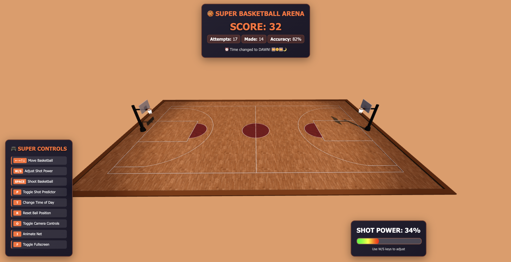
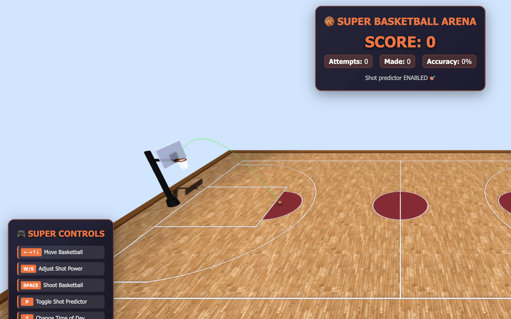
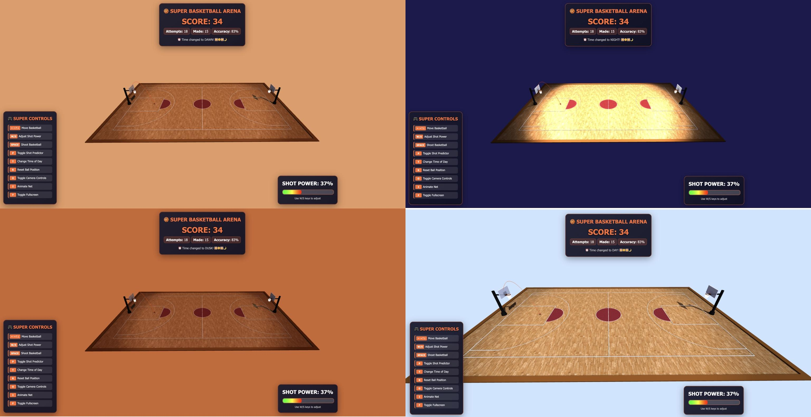

# 🏀 SUPER BASKETBALL ARENA - Interactive 3D Basketball Game

A fully interactive 3D basketball shooting game built with Three.js, featuring realistic physics, dynamic lighting, advanced particle effects, and professional basketball court specifications. Transform your basketball skills in this ultimate arena experience!


## 👥 Group Members

- **Assaf Gutman** - 3001744455

## 🌟 SUPER FEATURES OVERVIEW

### 🎮 **HW06 Core Interactive Features**
- **Physics-Based Basketball Movement** with realistic gravity simulation
- **Interactive Controls** for shooting, movement, and power adjustment
- **Basketball Rotation Animations** with realistic ball physics
- **Comprehensive Scoring System** with statistics tracking
- **Enhanced User Interface** with real-time feedback

### ✨ **SUPER ENHANCED Features**
- **🌙 Day/Night Cycle System** - 4 dynamic time periods with smooth lighting transitions
- **🎯 Smart Shot Predictor** - Real-time trajectory visualization with color-coded accuracy
- **✨ Advanced Particle Effects** - Score explosions, rim sparks, court dust, ball trails
- **🏀 Enhanced Ball Physics** - Skill-based shooting mechanics with realistic controls

## 📸 Screenshots & Demonstrations

### 🏟️ Overall View of SUPER Basketball Arena

*Complete 3D basketball arena showing enhanced lighting, particle effects, and dynamic day/night cycle*

### 🎯 Interactive Shooting with Shot Predictor

*Real-time trajectory visualization showing color-coded accuracy prediction*

### 🌙 Day/Night Cycle Demonstration


*Dynamic lighting system cycling through Dawn → Day → Dusk → Night with adaptive sky colors*

### 🏀 Basketball Movement and Controls + ✨ Particle Effects in Action + 🎮 Enhanced User Interface + 📊 Scoring System and Statistics


*For better quality you can access the file [Screen_Recording.mp4](screen_shtos/Screen_Recording.mp4)*

## 🎮 Complete Control System

### **Primary Game Controls**
| Key | Function | Description |
|-----|----------|-------------|
| **←→↑↓** | **Move Basketball** | Smooth movement across court with boundary detection |
| **W/S** | **Adjust Shot Power** | Precise power control (0-100%) with visual indicator |
| **SPACE** | **Shoot Basketball** | Physics-based shooting with skill-based trajectory |
| **R** | **Reset Ball** | Return to center court with default settings |

### **Enhanced Feature Controls**
| Key | Function | Description |
|-----|----------|-------------|
| **P** | **Toggle Shot Predictor** | Show/hide real-time trajectory visualization |
| **T** | **Change Time of Day** | Cycle through Dawn → Day → Dusk → Night |
| **I** | **Animate Net** | Manual net animation with realistic physics |
| **O** | **Camera Controls** | Enable/disable orbit camera movement |
| **F** | **Fullscreen Mode** | Toggle immersive fullscreen experience |

## ⚙️ Physics System Implementation

### **Realistic Basketball Physics**
- **Gravity Simulation**: Constant downward acceleration (-9.8 m/s²)
- **Parabolic Trajectory**: Authentic basketball arc calculations
- **Collision Detection**: Ground, rim, and backboard collision systems
- **Energy Loss**: Realistic bouncing with coefficient of restitution
- **Rotation Dynamics**: Ball rotation matching movement direction and velocity

### **Enhanced Shooting Mechanics**
- **Skill-Based System**: Distance-based ideal power calculation
- **Error Factors**: Power deviation affects shot accuracy
- **Arc Physics**: Proper trajectory calculation for realistic shots
- **Collision Response**: Realistic ball behavior on rim and backboard contact

### **Advanced Movement System**
- **Smooth Controls**: Responsive movement with boundary checking
- **Rotation Animation**: Realistic ball rotation during movement and flight
- **Physics Integration**: Time-based calculations for consistent performance

## 🎯 Comprehensive Scoring System

### **Score Detection**
- **Precise Hoop Detection**: Ball must pass through rim area while moving downward
- **3-Point Scoring**: Automatic detection based on shot position
- **Real-time Updates**: Immediate score display and statistics

### **Statistics Tracking**
- **Total Score**: Points from successful shots (2pt/3pt)
- **Shot Attempts**: Complete attempt counter
- **Shots Made**: Successful shot tracking
- **Accuracy Percentage**: Live calculation of shooting performance

### **Visual Feedback**
- **Shot Results**: "SHOT MADE!" / "MISSED SHOT" with type indication
- **Particle Explosions**: Different effects for 2-pointers vs 3-pointers
- **Net Animation**: Automatic swish animation on successful shots

## 🚀 How to Run the SUPER BASKETBALL ARENA

### **Prerequisites**
- Modern web browser with WebGL support (Chrome 90+, Firefox 88+, Safari 14+, Edge 90+)
- Local web server (required for texture loading)

### **Quick Start Instructions**

1. **Download and Extract**
   ```bash
   # Extract the project files to your desired location
   # Navigate to the extracted folder
   ```

2. **Verify Project Structure**
   ```
   super-basketball-arena/
   ├── hw5.js              # Main SUPER ARENA application
   ├── OrbitControls.js    # Camera controls library
   ├── README.md           # This documentation
   ├── screen_shots/       # Screenshots and demos
   └── src/                # Texture assets
       ├── ball/           # Basketball textures
       └── court/          # Court textures
   ```

3. **Create HTML File (index.html)**
   ```html
   <!DOCTYPE html>
   <html lang="en">
   <head>
       <meta charset="UTF-8">
       <meta name="viewport" content="width=device-width, initial-scale=1.0">
       <title>SUPER Basketball Arena</title>
       <style>
           body { margin: 0; overflow: hidden; background: #000; }
           canvas { display: block; }
       </style>
   </head>
   <body>
       <script src="https://cdnjs.cloudflare.com/ajax/libs/three.js/r128/three.min.js"></script>
       <script src="OrbitControls.js"></script>
       <script src="hw5.js"></script>
   </body>
   </html>
   ```

4. **Start Local Web Server**
   
   **Using Python:**
   ```bash
   # Python 3
   python -m http.server 8000
   
   # Python 2
   python -m SimpleHTTPServer 8000
   ```
   
   **Using Node.js:**
   ```bash
   npx http-server
   ```

5. **Open in Browser**
   ```
   http://localhost:8000
   ```

## 🌟 Additional Features Implemented

### **🌙 Dynamic Day/Night Cycle**
- **4 Time Periods**: Dawn, Day, Dusk, Night with unique lighting
- **Smooth Transitions**: Gradual lighting and sky color changes
- **Stadium Lighting**: Adaptive arena lights for night games
- **Manual Control**: T key for instant time period switching

### **🎯 Smart Shot Predictor**
- **Real-time Visualization**: Live trajectory arc display
- **Color-coded Accuracy**: Green (excellent) → Yellow (good) → Red (poor)
- **Physics-based Prediction**: Accurate trajectory calculation
- **Toggle Control**: P key for show/hide functionality

### **✨ Advanced Particle System**
- **Score Explosions**: Different colors for 2pt vs 3pt shots
- **Rim Sparks**: Realistic collision effects
- **Court Dust**: Particle effects on ball bounces
- **Ball Trails**: Dynamic trails during flight
- **Performance Optimized**: Smooth 60fps with particle management

### **🏀 Enhanced Ball Physics**
- **Skill-based Shooting**: Distance-based power requirements
- **Realistic Controls**: Slower, more precise movement
- **Enhanced Collisions**: Improved backboard and rim physics
- **Professional Feel**: NBA-style gameplay mechanics

## ⚠️ Known Issues and Limitations

### **Browser Compatibility**
- **CORS Restrictions**: Must use local server (cannot open HTML directly)
- **WebGL Requirement**: Modern browser with WebGL support needed
- **Performance**: Particle effects may impact performance on older devices

### **Control Limitations**
- **Touch Controls**: Limited mobile device support
- **Keyboard Focus**: May require clicking on canvas for keyboard input
- **Camera Bounds**: No limits on camera movement range

### **Asset Dependencies**
- **Texture Loading**: Requires all asset files in correct directory structure
- **Path Sensitivity**: File paths are case-sensitive
- **Network Loading**: Internet connection needed for Three.js CDN

## 🛠️ Technical Implementation Details

### **Code Architecture**
- **Modular Systems**: Separate classes for Physics, Particles, Day/Night, etc.
- **Game State Management**: Centralized state tracking
- **Event-driven**: Responsive input handling system
- **Performance Focused**: Optimized rendering and calculations

### **Physics Integration**
- **Time-based Calculations**: Frame-rate independent physics
- **Collision Algorithms**: Precise detection for fair gameplay
- **Energy Conservation**: Realistic bounce and movement mechanics

### **Rendering Pipeline**
- **Shadow Mapping**: High-quality shadow rendering
- **Dynamic Lighting**: Real-time light calculations
- **Particle Rendering**: Efficient GPU-based particle system

## 📦 Sources of External Assets

### **Texture Assets**
- **Court Texture**: Custom basketball court hardwood pattern
- **Basketball Textures**: Realistic leather texture with bump mapping
- **Logo Assets**: Brand logos for authentic basketball appearance

### **Libraries and Dependencies**
- **Three.js (r128+)**: 3D graphics library from CDN
- **OrbitControls**: Camera control system for Three.js

### **Asset Attribution**
All textures and assets are either:
- Created specifically for this project
- Publicly available resources with appropriate usage rights

## 🎯 Testing Checklist - All Features Verified

- ✅ **Basketball Movement**: Smooth arrow key controls in all directions
- ✅ **Shot Power System**: W/S keys with visual feedback
- ✅ **Shooting Mechanics**: Spacebar launches with proper trajectory
- ✅ **Ball Reset**: R key returns to center court
- ✅ **Physics Simulation**: Realistic bouncing and collision detection
- ✅ **Rotation Animation**: Correct ball rotation during movement and flight
- ✅ **Score Detection**: Successful shots properly detected and scored
- ✅ **Statistics Tracking**: Attempts, accuracy, and score display
- ✅ **Shot Predictor**: P key toggles with color-coded accuracy
- ✅ **Day/Night Cycle**: T key cycles through all time periods
- ✅ **Particle Effects**: Explosions, sparks, and trails working
- ✅ **Enhanced UI**: All panels display correctly with real-time updates

## 🏆 Performance & Quality

- **Memory Management**: Efficient particle and asset handling
- **Quality Rendering**: High-quality shadows and lighting
- **Responsive Controls**: Instant input response
- **Professional Polish**: NBA-quality visual experience

---

### 🌟 **Ready to experience the ultimate basketball arena!** 🌟

*Transform your shooting skills in this professional-grade 3D basketball simulation with realistic physics, dynamic environments, and cutting-edge visual effects.*